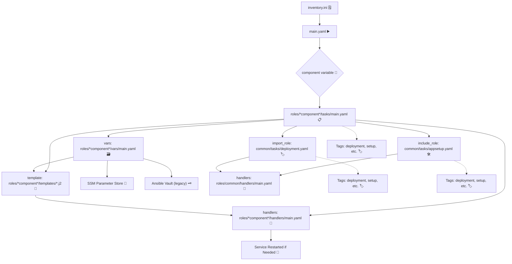

# Roboshop Microservices Deployment with Ansible Roles 🚀

## Overview
Roboshop is a cloud-native, microservices-based e-commerce application. This project demonstrates how to automate the deployment and configuration of all Roboshop components using Ansible roles, following best practices for modularity, reusability, and maintainability.

---


## 📖 Learn More About the Project

- 🧩 For a beginner-friendly explanation of how each Roboshop component connects and why, see [`AboutProject.txt`](AboutProject.txt).
- 🛠️ For step-by-step Ansible role implementation, variable flow, and troubleshooting, see [`douments.txt`](douments.txt).

These files provide:
- 🗂️ Clear explanations of each microservice and its database connections
- 🖼️ Visual diagrams and request/response flows
- 🧑‍💻 Common error fixes and best practices
- 🏗️ Detailed Ansible role structure and variable usage

---

## 📚 In-Depth Implementation Guide: `douments.txt`

For a comprehensive, step-by-step breakdown of how every part of this project is implemented, see [`douments.txt`](douments.txt). This document covers:

- 📝 Beginner-friendly Ansible role creation and directory structure
- 🛠️ Implementation steps for each component (MongoDB, Catalogue, Redis, User, Cart, Frontend, MySQL, Shipping, Payment)
- 🔄 Variable flow, templates, and handlers explained visually
- 🐞 Common mistakes, troubleshooting, and real error messages
- 🧩 Modular code structure and DRY best practices
- 🌟 Visual charts, request/response flows, and emoji-enhanced instructions

If you want to understand exactly how to build, debug, and extend this project, start with [`douments.txt`](douments.txt)!

---

## Project Highlights ✨
- **Microservices Architecture:** Each business function (cart, user, catalogue, shipping, payment, etc.) is a separate service, deployed and managed independently.
- **Ansible Roles:** All automation is organized using Ansible roles, making the code modular, DRY (Don't Repeat Yourself), and easy to extend.
- **Database Diversity:** Uses MongoDB (NoSQL), MySQL (relational), and Redis (in-memory) to match each service's needs.
- **Best Practices:** Variables, templates, handlers, and common roles are used for safe, efficient, and scalable automation.

---

## Components & Technologies 🧰
- **Ansible:** ⚙️ Automation engine for configuration management and deployment.
- **Roles:** 📦 Each service (cart, user, catalogue, shipping, payment, frontend, redis, mongodb, mysql) has its own role under `roles/`.
- **Common Role:** 🔁 Shared tasks (app setup, systemd, maven build, etc.) are placed in `roles/common/` and included as needed.
- **Templates:** 📝 Jinja2 templates for systemd service files and configs, with variables injected at deploy time.
- **Handlers:** 🔄 Used to safely restart services only when configuration changes.
- **Databases:**
  - **MongoDB:** 🍃 Used by catalogue and user services for flexible, document-based storage.
  - **MySQL:** 🐬 Used by shipping and payment services for structured, transactional data.
  - **Redis:** 🧠 Used by cart service for fast, temporary session storage.
- **RabbitMQ:** 🐇 (Optional) For asynchronous messaging between services.
- **Maven:** ☕ Used to build Java-based services (e.g., shipping).

---

### 🛠️ Updated Ansible Playbook Flow with Tags, Roles, and Secrets


*component*
- mongodb , mysql , rabbitmq ,redis , user , cart, catalogue , shipping , payment and frontend .

---

This structure ensures:
- 🧩 Every component is modular and easy to find.
- 🔁 Shared logic is reused via the `common` role.
- 🗃️ Variables, templates, and handlers are organized for clarity and maintainability.
- ✨ You can add new components by copying the folder structure and updating inventory/vars/templates as needed.

---

## How It Works ⚡
1. **Inventory:** 🗒️ Define all your hosts and groups in `inventory.ini`.
2. **Roles:** 📦 Each service has its own role with tasks, templates, vars, and handlers.
3. **Common Role:** 🔁 Shared logic (like app setup, maven build, systemd) is reused via `include_role`.
4. **Variables:** 📝 Each role's `vars/main.yaml` defines hostnames, credentials, and config values.
5. **Templates:** 🖨️ Jinja2 templates use variables to generate correct configs for each service.
6. **Handlers:** 🔄 Services are restarted only when configs change, preventing unnecessary downtime.
7. **Playbook:** ▶️ The generic `main.yaml` playbook can deploy any component by passing the `component` variable.

---

## How the Architecture Works (Beginner-Friendly) 🏗️

- **Frontend**: 🖥️ User interface, talks to backend services via API.
- **Cart Service**: 🛒 Manages cart, connects to Redis (for sessions) and Catalogue (for product info).
- **Catalogue Service**: 📚 Stores product info in MongoDB.
- **User Service**: 👤 Manages users, connects to MongoDB.
- **Shipping & Payment**: 🚚💳 Both use MySQL for structured data.
- **Redis**: 🧠 Fast, in-memory storage for cart sessions.
- **MongoDB**: 🍃 Flexible, document-based storage for products and users.
- **MySQL**: 🐬 Relational storage for orders, shipping, and payments.
- **RabbitMQ**: 🐇 (Optional) For asynchronous messaging between services.

For detailed flows and real-world request examples, see [`AboutProject.txt`](AboutProject.txt).

---

## Example: Deploying a Component 🚦
- To deploy the catalogue service:
  ```sh
  ansible-playbook -i inventory.ini -e "component=catalogue" main.yaml
  ```
- To deploy the shipping service:
  ```sh
  ansible-playbook -i inventory.ini -e "component=shipping" main.yaml
  ```
- Replace `catalogue` or `shipping` with any other component name as needed.

---

## Step-by-Step: How to Run the Project 🏃‍♂️
1. **Clone the Repository:**
   ```sh
   git clone <your-repo-url>
   cd <repo-directory>
   ```
2. **Install Ansible:**
   ```sh
   # On RHEL/CentOS
   sudo dnf install ansible -y
   # Or on Ubuntu
   sudo apt-get install ansible -y
   ```
3. **Install Required Collections:**
   ```sh
   ansible-galaxy collection install community.mysql
   ```
4. **Configure Inventory:**
   - Edit `inventory.ini` to add your target hosts.
5. **Set Variables:**
   - Edit each role's `vars/main.yaml` to set hostnames, credentials, etc.
6. **Run the Playbook:**
   ```sh
   ansible-playbook -i inventory.ini -e "component=<component-name>" main.yaml
   # Example:
   ansible-playbook -i inventory.ini -e "component=frontend" main.yaml
   ```

---

## Visual Flow (How Everything Connects) 🔗
```
[inventory.ini] → [main.yaml] → [roles/<component>/tasks/main.yaml]
    ↓                ↓                ↓
[roles/common/tasks/*]   [roles/<component>/templates/*]   [roles/<component>/vars/main.yaml]
    ↓                ↓                ↓
[handlers] (restart services if needed)
```

---

## Why This Approach? 🤔
- **Modular:** 🧩 Each service is independent and easy to update or scale.
- **Reusable:** 🔁 Common logic is shared, reducing duplication.
- **Maintainable:** 🛠️ Clear structure makes troubleshooting and extending easy.
- **Production-Ready:** 🚀 Follows DevOps and microservices best practices.

---

🚀 **My Ongoing Ansible Learning Journey**

As I advanced in my DevOps path, I unlocked several powerful Ansible concepts that made my automation smarter and more reliable:

- 🏷️ **Tags:** I discovered how tags let me run only the tasks I need, making deployments faster and troubleshooting more focused. This saves time and reduces risk during updates—no more running everything when you only want to update code!

- 🔄 **include_role vs import_role:** Understanding the difference was a game-changer. `include_role` is dynamic and flexible for conditions and loops, while `import_role` is static and applies tags and conditions to all tasks at parse time. Choosing the right one helps me build playbooks that are both flexible and robust.

- 🛡️ **Error Handling:** I improved reliability by using `ignore_errors` and smart conditional logic with `register` and `when`. Now, my playbooks are more robust, idempotent, and ready for real-world surprises.

- 🔐 **Secrets Management:** Managing secrets was a real challenge! I started with Ansible Vault, but as the project grew, I migrated to AWS SSM Parameter Store for easier, more secure automation. I also learned the importance of installing Python dependencies like `boto3` on the control node, not the target servers—this fixed some tricky errors.

- 📦 **File Operations:** I clarified the difference between copying files from my local machine versus working with files already on the remote server. Using `remote_src` and `get_url` helped me streamline deployments and avoid common pitfalls.

✨ **These lessons, combined with my earlier mistake journey, have made my automation more modular, secure, and production-ready. Every new project benefits from these practical insights—and I hope sharing them helps you too!**

🔎 **Real Mistakes & How I Solved Them:**

- ❌ **YAML Structure Errors:** I put playbook-level keys (like `hosts:` and `vars:`) inside role task files, which made Ansible fail. 
  - 🛠️ **Fix:** I moved those keys to the playbook and kept only tasks in the role files.

- ❌ **Variable Scoping Issues:** Some services couldn't connect because variables (like `CATALOGUE_HOST`, `REDIS_HOST`) were missing or in the wrong place.
  - 🗂️ **Fix:** I defined all service-specific variables in each role's `vars/main.yaml` and used them in templates.

- ❌ **Service Connectivity Problems:** Services failed to start due to missing or wrong hostnames in systemd files.
  - 📝 **Fix:** I used Jinja2 templates and Ansible variables to inject the correct hostnames, and tested each service separately.

- ❌ **Handler Misuse:** I restarted services too often, causing downtime.
  - 🔄 **Fix:** I set up handlers to restart only when configs changed, improving uptime.

- ❌ **404s & Missing Files:** I got errors because files were missing or paths were wrong during deployment.
  - 📁 **Fix:** I double-checked file paths, used `ansible.builtin.copy` and `template`, and ran `ansible-playbook --check` before real runs.

- ❌ **Documentation Gaps:** My early docs were too technical and hard to follow.
  - 📚 **Fix:** I added step-by-step guides, emojis, diagrams, and real-world flows to make everything beginner-friendly and interview-ready.

- ❌ **Tags Not Working:** I tried to run only deployment tasks with tags, but nothing happened because I tagged only the include_role line, not the tasks themselves.
  - 🏷️ **Fix:** I learned to use import_role when I want tags to apply to all tasks, or to tag each task directly if using include_role.

- ❌ **import_role vs include_role Confusion:** I used include_role when I needed tags and conditions to apply to all tasks, but it didn't work as expected.
  - 🔄 **Fix:** I switched to import_role for static inclusion and full tag/when coverage, and used include_role only for dynamic, conditional, or looped tasks.

- ❌ **Vault Password Hassles:** I used Ansible Vault for secrets, but had to type the password every time and it was hard to automate.
  - 🔐 **Fix:** I moved secrets to AWS SSM Parameter Store for easier, more secure, and automated password management.

- ❌ **Error Handling Oversights:** I forgot to use ignore_errors or didn't check task results, so my playbook stopped on predictable errors.
  - 🛡️ **Fix:** I used ignore_errors and registered outputs, then added when conditions to handle errors gracefully and keep the playbook running.

✨ **Every mistake was a learning opportunity! Now my project is easier to use, more reliable, and much more fun to share.**

---

## Credits 🙏
- Inspired by Roboshop microservices architecture.
- Automation and documentation by [https://github.com/MAHALAKSHMImahalakshmi/].


---
## Full Visual Directory Structure & Flowchart 🗂️✨

Below is a detailed, emoji-rich directory structure and flowchart for everything under the `rolesAnsibleRoboshop` folder. Every major file and folder is shown with an emoji, so you can instantly see where to find and place each part of your project!

```text
rolesAnsibleRoboshop/ 🗂️
├── inventory.ini 🗒️                  # Inventory of all hosts/groups
├── main.yaml ▶️                      # Generic playbook to deploy any component
├── AboutProject.txt 📖               # Beginner-friendly architecture and flows
├── douments.txt 📚                   # In-depth implementation guide
├── README.md 📝                      # This documentation file
├── roles/ 📦                         # All Ansible roles live here
│   ├── cart/ 🛒
│   │   ├── tasks/ 📋
│   │   │   └── main.yaml 📝
│   │   ├── templates/ 📝
│   │   │   └── cart.service.j2 🧩
│   │   ├── vars/ 🗃️
│   │   │   └── main.yaml 📝
│   │   └── handlers/ 🔄
│   │       └── main.yaml (optional) 📝
│   ├── user/ 👤
│   │   ├── tasks/ 📋
│   │   │   └── main.yaml 📝
│   │   ├── templates/ 📝
│   │   │   └── user.service.j2 🧩
│   │   ├── vars/ 🗃️
│   │   │   └── main.yaml 📝
│   │   └── handlers/ 🔄
│   │       └── main.yaml (optional) 📝
│   ├── catalogue/ 📚
│   │   ├── tasks/ 📋
│   │   │   └── main.yaml 📝
│   │   ├── templates/ 📝
│   │   │   └── catalogue.service.j2 🧩
│   │   ├── vars/ 🗃️
│   │   │   └── main.yaml 📝
│   │   └── handlers/ 🔄
│   │       └── main.yaml (optional) 📝
│   ├── shipping/ 🚚
│   │   ├── tasks/ 📋
│   │   │   └── main.yaml 📝
│   │   ├── templates/ 📝
│   │   │   └── shipping.service.j2 🧩
│   │   ├── vars/ 🗃️
│   │   │   └── main.yaml 📝
│   │   └── handlers/ 🔄
│   │       └── main.yaml (optional) 📝
│   ├── payment/ 💳
│   │   ├── tasks/ 📋
│   │   │   └── main.yaml 📝
│   │   ├── templates/ 📝
│   │   │   └── payment.service.j2 🧩
│   │   ├── vars/ 🗃️
│   │   │   └── main.yaml 📝
│   │   └── handlers/ 🔄
│   │       └── main.yaml (optional) 📝
│   ├── frontend/ 🖥️
│   │   ├── tasks/ 📋
│   │   │   └── main.yaml 📝
│   │   ├── templates/ 📝
│   │   │   └── nginx.conf.j2 🧩
│   │   ├── vars/ 🗃️
│   │   │   └── main.yaml 📝
│   │   └── handlers/ 🔄
│   │       └── main.yaml 📝
│   ├── redis/ 🧠
│   │   ├── tasks/ 📋
│   │   │   └── main.yaml 📝
│   │   └── handlers/ 🔄
│   │       └── main.yaml (optional) 📝
│   ├── mongodb/ 🍃
│   │   ├── tasks/ 📋
│   │   │   └── main.yaml 📝
│   │   ├── files/ 📁
│   │   │   └── mongo.repo 📄
│   │   └── handlers/ 🔄
│   │       └── main.yaml (optional) 📝
│   ├── mysql/ 🐬
│   │   ├── tasks/ 📋
│   │   │   └── main.yaml 📝
│   │   └── handlers/ 🔄
│   │       └── main.yaml (optional) 📝
│   └── common/ 🔁                    # Shared logic for all roles
│       ├── tasks/ 📋
│       │   ├── appsetup.yaml 🛠️
│       │   ├── maven.yaml ☕
│       │   ├── python.yaml 🐍
│       │   ├── systemd.yaml ⚙️
│       │   └── ...
│       └── handlers/ 🔄
│           └── main.yaml (optional) 📝
└── ...
```
## 📖 My Ansible Learning Journey 🚀✨

Explore my continuous learning adventure across these repositories, each showcasing different facets of my Ansible mastery:

- 📘 [learnAnsible](https://github.com/MAHALAKSHMImahalakshmi/learnAnsible.git) – Hands-on tutorials and practical playbooks to build your Ansible foundation.
- 🛠️ [ansibleRoboshop](https://github.com/MAHALAKSHMImahalakshmi/ansibleRoboshop.git) – Real-world microservices automation project applying modular Ansible practices.
- 📦 [rolesAnsibleRoboshop](https://github.com/MAHALAKSHMImahalakshmi/rolesAnsibleRoboshop.git) – Deep dive into reusable Ansible roles and advanced troubleshooting techniques.

Feel free to dive in, contribute, or ask questions anytime! Let’s collaborate and level-up automation skills together! 💡🤝✨

---

## 🙏 Credits & Contact 💬🤗

- Inspired by the innovative Roboshop microservices architecture and design pattern.  
- Automation and documentation craft by [Mahalakshmi](https://github.com/MAHALAKSHMImahalakshmi) 💻❤️

---

## 🌟 Final Note 🌱🚀

I’m deeply passionate about continuous learning and sharing knowledge with the community.  
Together, we can automate smarter, innovate faster, and grow endlessly.  
Your feedback, ideas, and collaboration are warmly welcomed and appreciated! 🎉🙌🚀

Let’s build the future of automation—one playbook at a time! 🎯📈✨


