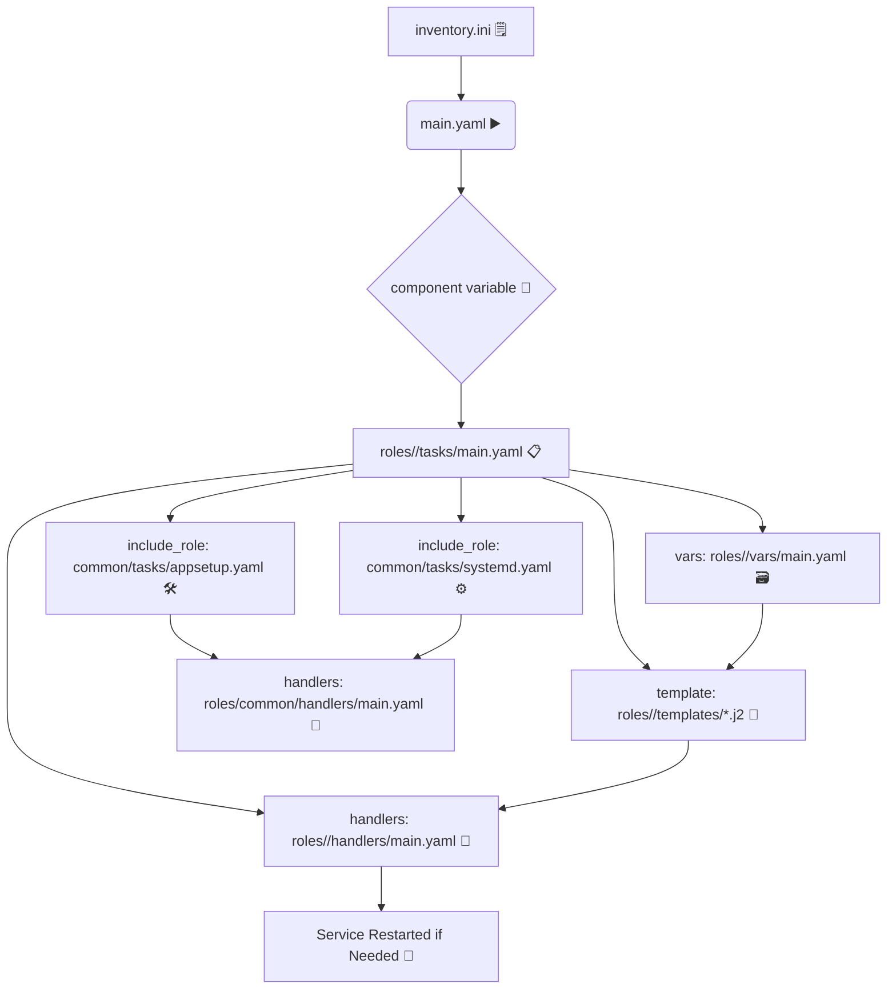

# Roboshop Microservices Deployment with Ansible Roles 🚀

## Overview
Roboshop is a cloud-native, microservices-based e-commerce application. This project demonstrates how to automate the deployment and configuration of all Roboshop components using Ansible roles, following best practices for modularity, reusability, and maintainability.

---


## 📖 Learn More About the Project

- 🧩 For a beginner-friendly explanation of how each Roboshop component connects and why, see [`AboutProject.txt`](AboutProject.txt).
- 🛠️ For step-by-step Ansible role implementation, variable flow, and troubleshooting, see [`douments.txt`](douments.txt).

These files provide:
- 🗂️ Clear explanations of each microservice and its database connections
- 🖼️ Visual diagrams and request/response flows
- 🧑‍💻 Common error fixes and best practices
- 🏗️ Detailed Ansible role structure and variable usage

---

## 📚 In-Depth Implementation Guide: `douments.txt`

For a comprehensive, step-by-step breakdown of how every part of this project is implemented, see [`douments.txt`](douments.txt). This document covers:

- 📝 Beginner-friendly Ansible role creation and directory structure
- 🛠️ Implementation steps for each component (MongoDB, Catalogue, Redis, User, Cart, Frontend, MySQL, Shipping, Payment)
- 🔄 Variable flow, templates, and handlers explained visually
- 🐞 Common mistakes, troubleshooting, and real error messages
- 🧩 Modular code structure and DRY best practices
- 🌟 Visual charts, request/response flows, and emoji-enhanced instructions

If you want to understand exactly how to build, debug, and extend this project, start with [`douments.txt`](douments.txt)!

---

## Project Highlights ✨
- **Microservices Architecture:** Each business function (cart, user, catalogue, shipping, payment, etc.) is a separate service, deployed and managed independently.
- **Ansible Roles:** All automation is organized using Ansible roles, making the code modular, DRY (Don't Repeat Yourself), and easy to extend.
- **Database Diversity:** Uses MongoDB (NoSQL), MySQL (relational), and Redis (in-memory) to match each service's needs.
- **CI/CD Ready:** The structure supports automated, repeatable deployments—ideal for DevOps and cloud-native environments.
- **Best Practices:** Variables, templates, handlers, and common roles are used for safe, efficient, and scalable automation.

---

## Components & Technologies 🧰
- **Ansible:** ⚙️ Automation engine for configuration management and deployment.
- **Roles:** 📦 Each service (cart, user, catalogue, shipping, payment, frontend, redis, mongodb, mysql) has its own role under `roles/`.
- **Common Role:** 🔁 Shared tasks (app setup, systemd, maven build, etc.) are placed in `roles/common/` and included as needed.
- **Templates:** 📝 Jinja2 templates for systemd service files and configs, with variables injected at deploy time.
- **Handlers:** 🔄 Used to safely restart services only when configuration changes.
- **Databases:**
  - **MongoDB:** 🍃 Used by catalogue and user services for flexible, document-based storage.
  - **MySQL:** 🐬 Used by shipping and payment services for structured, transactional data.
  - **Redis:** 🧠 Used by cart service for fast, temporary session storage.
- **RabbitMQ:** 🐇 (Optional) For asynchronous messaging between services.
- **Maven:** ☕ Used to build Java-based services (e.g., shipping).

---


## Full Visual Directory Structure & Flowchart 🗂️✨

Below is a detailed, emoji-rich directory structure and flowchart for everything under the `rolesAnsibleRoboshop` folder. Every major file and folder is shown with an emoji, so you can instantly see where to find and place each part of your project!

```text
rolesAnsibleRoboshop/ 🗂️
├── inventory.ini 🗒️                  # Inventory of all hosts/groups
├── main.yaml ▶️                      # Generic playbook to deploy any component
├── AboutProject.txt 📖               # Beginner-friendly architecture and flows
├── douments.txt 📚                   # In-depth implementation guide
├── README.md 📝                      # This documentation file
├── roles/ 📦                         # All Ansible roles live here
│   ├── cart/ 🛒
│   │   ├── tasks/ 📋
│   │   │   └── main.yaml 📝
│   │   ├── templates/ 📝
│   │   │   └── cart.service.j2 🧩
│   │   ├── vars/ 🗃️
│   │   │   └── main.yaml 📝
│   │   └── handlers/ 🔄
│   │       └── main.yaml (optional) 📝
│   ├── user/ 👤
│   │   ├── tasks/ 📋
│   │   │   └── main.yaml 📝
│   │   ├── templates/ 📝
│   │   │   └── user.service.j2 🧩
│   │   ├── vars/ 🗃️
│   │   │   └── main.yaml 📝
│   │   └── handlers/ 🔄
│   │       └── main.yaml (optional) 📝
│   ├── catalogue/ 📚
│   │   ├── tasks/ 📋
│   │   │   └── main.yaml 📝
│   │   ├── templates/ 📝
│   │   │   └── catalogue.service.j2 🧩
│   │   ├── vars/ 🗃️
│   │   │   └── main.yaml 📝
│   │   └── handlers/ 🔄
│   │       └── main.yaml (optional) 📝
│   ├── shipping/ 🚚
│   │   ├── tasks/ 📋
│   │   │   └── main.yaml 📝
│   │   ├── templates/ 📝
│   │   │   └── shipping.service.j2 🧩
│   │   ├── vars/ 🗃️
│   │   │   └── main.yaml 📝
│   │   └── handlers/ 🔄
│   │       └── main.yaml (optional) 📝
│   ├── payment/ 💳
│   │   ├── tasks/ 📋
│   │   │   └── main.yaml 📝
│   │   ├── templates/ 📝
│   │   │   └── payment.service.j2 🧩
│   │   ├── vars/ 🗃️
│   │   │   └── main.yaml 📝
│   │   └── handlers/ 🔄
│   │       └── main.yaml (optional) 📝
│   ├── frontend/ 🖥️
│   │   ├── tasks/ 📋
│   │   │   └── main.yaml 📝
│   │   ├── templates/ 📝
│   │   │   └── nginx.conf.j2 🧩
│   │   ├── vars/ 🗃️
│   │   │   └── main.yaml 📝
│   │   └── handlers/ 🔄
│   │       └── main.yaml 📝
│   ├── redis/ 🧠
│   │   ├── tasks/ 📋
│   │   │   └── main.yaml 📝
│   │   └── handlers/ 🔄
│   │       └── main.yaml (optional) 📝
│   ├── mongodb/ 🍃
│   │   ├── tasks/ 📋
│   │   │   └── main.yaml 📝
│   │   ├── files/ 📁
│   │   │   └── mongo.repo 📄
│   │   └── handlers/ 🔄
│   │       └── main.yaml (optional) 📝
│   ├── mysql/ 🐬
│   │   ├── tasks/ 📋
│   │   │   └── main.yaml 📝
│   │   └── handlers/ 🔄
│   │       └── main.yaml (optional) 📝
│   └── common/ 🔁                    # Shared logic for all roles
│       ├── tasks/ 📋
│       │   ├── appsetup.yaml 🛠️
│       │   ├── maven.yaml ☕
│       │   ├── python.yaml 🐍
│       │   ├── systemd.yaml ⚙️
│       │   └── ...
│       └── handlers/ 🔄
│           └── main.yaml (optional) 📝
└── ...
```

### 📊 Flowchart: How a Playbook Runs in This Structure



This structure ensures:
- 🧩 Every component is modular and easy to find.
- 🔁 Shared logic is reused via the `common` role.
- 🗃️ Variables, templates, and handlers are organized for clarity and maintainability.
- ✨ You can add new components by copying the folder structure and updating inventory/vars/templates as needed.

---

## How It Works ⚡
1. **Inventory:** 🗒️ Define all your hosts and groups in `inventory.ini`.
2. **Roles:** 📦 Each service has its own role with tasks, templates, vars, and handlers.
3. **Common Role:** 🔁 Shared logic (like app setup, maven build, systemd) is reused via `include_role`.
4. **Variables:** 📝 Each role's `vars/main.yaml` defines hostnames, credentials, and config values.
5. **Templates:** 🖨️ Jinja2 templates use variables to generate correct configs for each service.
6. **Handlers:** 🔄 Services are restarted only when configs change, preventing unnecessary downtime.
7. **Playbook:** ▶️ The generic `main.yaml` playbook can deploy any component by passing the `component` variable.

---

## How the Architecture Works (Beginner-Friendly) 🏗️

- **Frontend**: 🖥️ User interface, talks to backend services via API.
- **Cart Service**: 🛒 Manages cart, connects to Redis (for sessions) and Catalogue (for product info).
- **Catalogue Service**: 📚 Stores product info in MongoDB.
- **User Service**: 👤 Manages users, connects to MongoDB.
- **Shipping & Payment**: 🚚💳 Both use MySQL for structured data.
- **Redis**: 🧠 Fast, in-memory storage for cart sessions.
- **MongoDB**: 🍃 Flexible, document-based storage for products and users.
- **MySQL**: 🐬 Relational storage for orders, shipping, and payments.
- **RabbitMQ**: 🐇 (Optional) For asynchronous messaging between services.

For detailed flows and real-world request examples, see [`AboutProject.txt`](AboutProject.txt).

---

## Example: Deploying a Component 🚦
- To deploy the catalogue service:
  ```sh
  ansible-playbook -i inventory.ini -e "component=catalogue" main.yaml
  ```
- To deploy the shipping service:
  ```sh
  ansible-playbook -i inventory.ini -e "component=shipping" main.yaml
  ```
- Replace `catalogue` or `shipping` with any other component name as needed.

---

## Step-by-Step: How to Run the Project 🏃‍♂️
1. **Clone the Repository:**
   ```sh
   git clone <your-repo-url>
   cd <repo-directory>
   ```
2. **Install Ansible:**
   ```sh
   # On RHEL/CentOS
   sudo dnf install ansible -y
   # Or on Ubuntu
   sudo apt-get install ansible -y
   ```
3. **Install Required Collections:**
   ```sh
   ansible-galaxy collection install community.mysql
   ```
4. **Configure Inventory:**
   - Edit `inventory.ini` to add your target hosts.
5. **Set Variables:**
   - Edit each role's `vars/main.yaml` to set hostnames, credentials, etc.
6. **Run the Playbook:**
   ```sh
   ansible-playbook -i inventory.ini -e "component=<component-name>" main.yaml
   # Example:
   ansible-playbook -i inventory.ini -e "component=frontend" main.yaml
   ```

---

## Visual Flow (How Everything Connects) 🔗
```
[inventory.ini] → [main.yaml] → [roles/<component>/tasks/main.yaml]
    ↓                ↓                ↓
[roles/common/tasks/*]   [roles/<component>/templates/*]   [roles/<component>/vars/main.yaml]
    ↓                ↓                ↓
[handlers] (restart services if needed)
```

---

## Why This Approach? 🤔
- **Modular:** 🧩 Each service is independent and easy to update or scale.
- **Reusable:** 🔁 Common logic is shared, reducing duplication.
- **Maintainable:** 🛠️ Clear structure makes troubleshooting and extending easy.
- **Production-Ready:** 🚀 Follows DevOps and microservices best practices.

---

## My Mistake Journey & Lessons Learned 🛤️💡

Throughout this project, I encountered several real-world mistakes and learned valuable lessons that shaped my DevOps thinking. Sharing these in interviews shows not just technical skill, but growth mindset and resilience:

- **YAML Structure Errors:**
  - ❌ I initially put playbook-level keys (like `hosts:` and `vars:`) inside role task files, causing Ansible to fail. 
  - ✅ Lesson: Role task files should only contain tasks. I fixed this by moving playbook keys to the playbook and keeping roles modular.

- **Variable Scoping Issues:**
  - ❌ Services couldn't connect because variables (like `CATALOGUE_HOST`, `REDIS_HOST`) were undefined or misplaced.
  - ✅ Lesson: Always define service-specific variables in each role's `vars/main.yaml` and use them in templates for reliable configuration.

- **Service Connectivity Problems:**
  - ❌ Some services failed to start due to missing or incorrect hostnames in systemd files.
  - ✅ Lesson: Use Jinja2 templates and Ansible variables to inject correct hostnames, and test each service independently.

- **Handler Misuse:**
  - ❌ I restarted services unnecessarily, causing downtime.
  - ✅ Lesson: Use handlers to restart only when configs change, improving uptime and reliability.

- **Debugging 404s & Missing Files:**
  - ❌ Faced 404 errors and missing file issues during deployment.
  - ✅ Lesson: Double-check file paths, use `ansible.builtin.copy` and `template` modules, and verify with `ansible-playbook --check` before running for real.

- **Documentation Gaps:**
  - ❌ My early docs were too technical and not beginner-friendly.
  - ✅ Lesson: Added step-by-step guides, emojis, diagrams, and real-world flows to make the project accessible and impressive for interviews.

**Result:**
- Every mistake became a learning opportunity. My final project is not just technically sound, but also easy to understand, maintain, and present in interviews. 🌟

---

## Credits 🙏
- Inspired by Roboshop microservices architecture.
- Automation and documentation by [https://github.com/MAHALAKSHMImahalakshmi/].


